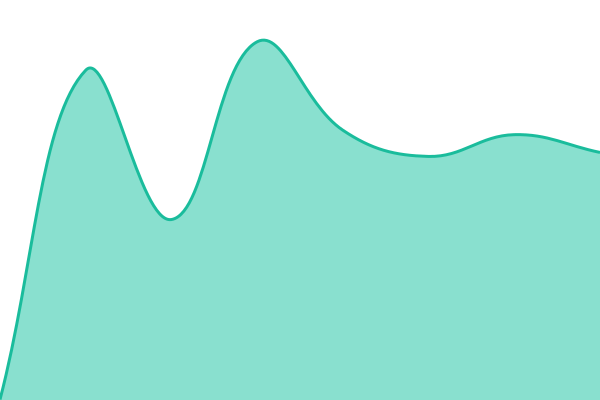
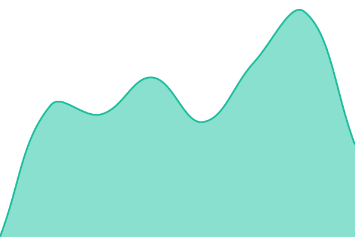
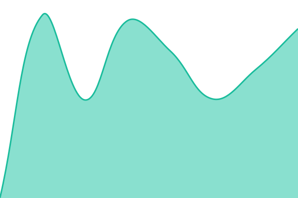
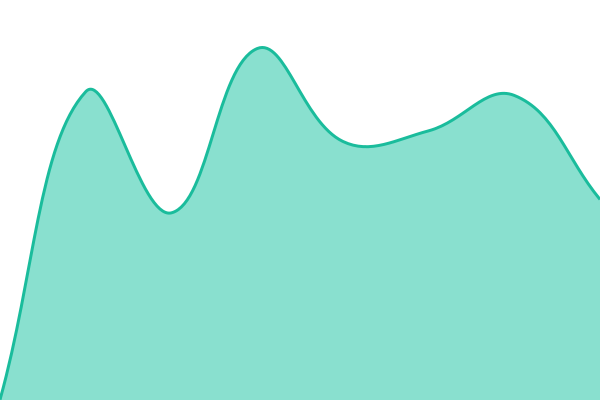

# [📈 Live Status](https://4fra.github.io/status): <!--live status--> **🟩 All systems operational**

This repository contains the open-source uptime monitor and status page for [Franciszek Grzywaczewski](https://4fra.github.io/status), powered by [Upptime](https://github.com/upptime/upptime).

With [Upptime](https://upptime.js.org), you can get your own unlimited and free uptime monitor and status page, powered entirely by a GitHub repository. We use [Issues](https://github.com/4fra/status/issues) as incident reports, [Actions](https://github.com/4fra/status/actions) as uptime monitors, and [Pages](https://4fra.github.io/status) for the status page.

<!--start: status pages-->
<!-- This summary is generated by Upptime (https://github.com/upptime/upptime) -->
<!-- Do not edit this manually, your changes will be overwritten -->
<!-- prettier-ignore -->
| URL | Status | History | Response Time | Uptime |
| --- | ------ | ------- | ------------- | ------ |
|  [Allegro](https://allegro.404fra.pl/status) | 🟩 Up | [allegro.yml](https://github.com/4fra/status/commits/HEAD/history/allegro.yml) | 

 695ms
     
 | 

<a href="https://4fra.github.io/status/history/allegro">100.00%</a>
    

|  [Codex LB](https://codex-lb.404fra.pl/health) | 🟩 Up | [codex-lb.yml](https://github.com/4fra/status/commits/HEAD/history/codex-lb.yml) | 

 696ms
     
 | 

<a href="https://4fra.github.io/status/history/codex-lb">100.00%</a>
    

|  [OpenTrashMail](https://mail.plutomierz.ovh/api/status) | 🟩 Up | [open-trash-mail.yml](https://github.com/4fra/status/commits/HEAD/history/open-trash-mail.yml) | 

 665ms
     
 | 

<a href="https://4fra.github.io/status/history/open-trash-mail">100.00%</a>
    

|  [PocketBase](https://pb.404fra.pl/api/health) | 🟩 Up | [pocket-base.yml](https://github.com/4fra/status/commits/HEAD/history/pocket-base.yml) | 

 694ms
     
 | 

<a href="https://4fra.github.io/status/history/pocket-base">100.00%</a>
    

|  [RR Staging](https://rr-staging.404fra.pl) | 🟩 Up | [rr-staging.yml](https://github.com/4fra/status/commits/HEAD/history/rr-staging.yml) | 

 702ms
     
 | 

<a href="https://4fra.github.io/status/history/rr-staging">100.00%</a>
    

|  [RR Tiles](https://rr-tiles.404fra.pl) | 🟩 Up | [rr-tiles.yml](https://github.com/4fra/status/commits/HEAD/history/rr-tiles.yml) | 

 655ms
     
 | 

<a href="https://4fra.github.io/status/history/rr-tiles">100.00%</a>
    

|  [ZSL Gdansk](https://zslgdansk.pl) | 🟩 Up | [zsl-gdansk.yml](https://github.com/4fra/status/commits/HEAD/history/zsl-gdansk.yml) | 

 1008ms
     
 | 

<a href="https://4fra.github.io/status/history/zsl-gdansk">100.00%</a>
    

<!--end: status pages-->

[**Visit our status website →**](https://4fra.github.io/status)

## 📄 License

- Powered by: [Upptime](https://github.com/upptime/upptime)
- Code: [MIT](./LICENSE) © [Anand Chowdhary](https://anandchowdhary.com), supported by [Pabio](https://pabio.com)
- Data in the `./history` directory: [Open Database License](https://opendatacommons.org/licenses/odbl/1-0/)
